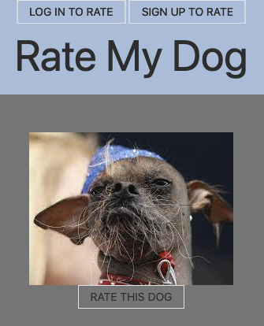

# Rate My Dog
  
  ## Description
  Rate My Dog is a full stack application that allows authorized users to rate and comment on their favorite ugly dogs.

  
  ## Table of Contents
  * [Installation](#installation)
  * [Usage](#usage)
  * [License](#license)
  * [Contributing](#contributing)
  * [Tests](#tests)
  * [GitHub](#github)

  ## Installation
  Use the deployed version at: https://secret-mesa-68493.herokuapp.com/.

  ## Usage
  Log in or sign up to upvote or comment on your favorite ugly dog.  
  

  ## License
    
  Rate my Dog uses the [MIT](https://opensource.org/licenses/MIT) license.

  ## Contributing
  Rate My Dog was created by Aisha Osman, Cassie Simpson, Emily Thon, and Jesse Koon.

  This project follows the Contributor Covenant.  
  
